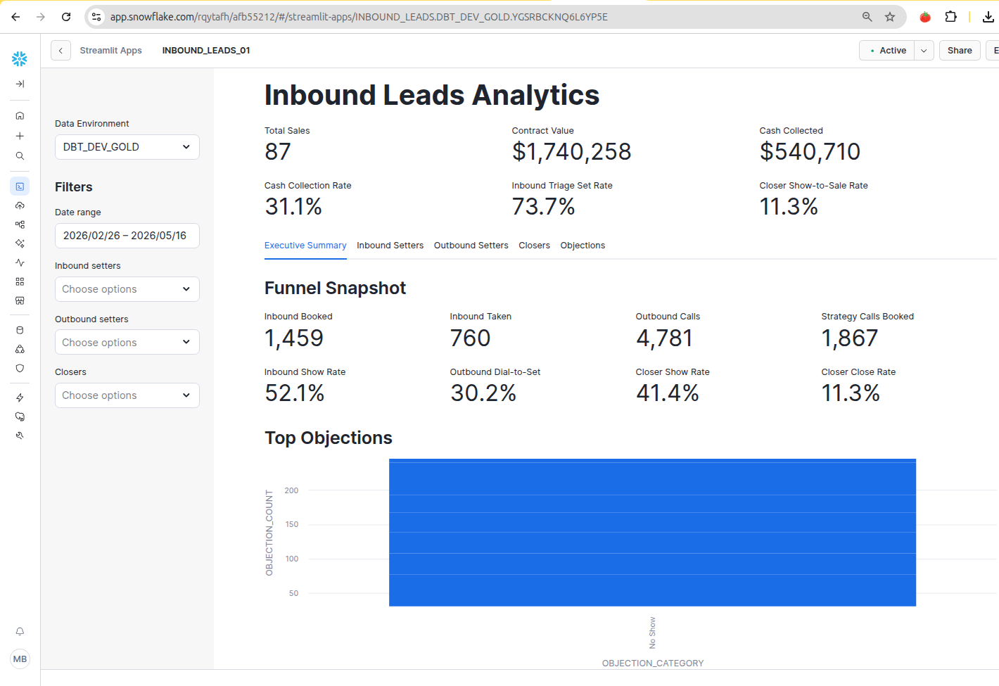

# Inbound Leads Analytics

<p>
  
</p>

## Project Overview

This project designs and implements an end-to-end data engineering pipeline for sales analytics. The goal is to provide a unified analytical view of inbound and outbound sales performance using Close CRM source data.

The pipeline tracks the full sales funnel:

```text
Initial Contact
  -> Triage Call for inbound leads
  -> Prospecting activity for outbound leads

Strategy Call
  -> booked, attended, no-show, canceled, follow-up, lost, sale

Sales Outcome
  -> sale status, contracted value, cash collected
```

The final solution should support BI dashboards for sales stakeholders, helping them measure conversion rates, sales team performance, funnel drop-offs, objections, and revenue outcomes.

## Technology Stack

| Layer | Technology | Purpose |
|---|---|---|
| Source System | PostgreSQL | Source database containing raw Close CRM tables |
| Data Extraction | Python / SQL | Extract raw source tables from PostgreSQL |
| Object Storage | Amazon S3 | Landing zone for raw extracted files |
| Data Warehouse | Snowflake | Central warehouse for raw, cleaned, and analytical data |
| Transformation | dbt Cloud | SQL-based transformation, testing, documentation, and lineage |
| Data Modeling | Snowflake + dbt | Bronze, Silver, and Gold medallion architecture |
| BI / Reporting | Streamlit in Snowflake | Dashboards for sales operations and funnel KPIs |
| Version Control | GitHub | Source control for SQL, dbt models, documentation, and EDA |

## Target Architecture

```text
PostgreSQL Source Database
(raw Close CRM tables)
        |
        | 1. Extract raw tables using Python / SQL
        v
Amazon S3 Landing Zone
(raw JSON / CSV / Parquet files partitioned by load date)
        |
        | 2. Snowflake external stage + COPY INTO
        v
Snowflake BRONZE Schema
(raw loaded data with minimal transformation)
        |
        | 3. dbt staging and cleaning models
        v
Snowflake SILVER Schema
(cleaned, flattened, deduplicated, normalized data)
        |
        | 4. dbt marts and business logic models
        v
Snowflake GOLD Schema
(facts, dimensions, funnel models, KPI report views)
        |
        | 5. Stramlit dashboard (provided by Snowflake)
        v
Business Reporting
(inbound setter, outbound setter, closer, objections)
```

## Data Warehousing Strategy

Snowflake is used as the central analytical data warehouse. The warehouse is organized using a medallion architecture:

```text
BRONZE -> SILVER -> GOLD
```

The Snowflake database for this project is:

```text
INBOUND_LEADS
```

The project uses dbt target schemas plus layer-specific custom schemas.

For local development:

```text
Base target schema: DBT_DEV

INBOUND_LEADS.DBT_DEV_BRONZE
INBOUND_LEADS.DBT_DEV_SILVER
INBOUND_LEADS.DBT_DEV_GOLD
INBOUND_LEADS.DBT_DEV_REFERENCE
INBOUND_LEADS.DBT_DEV_AUDIT
```

For production:

```text
Base target schema: PUBLIC

INBOUND_LEADS.PUBLIC_BRONZE
INBOUND_LEADS.PUBLIC_SILVER
INBOUND_LEADS.PUBLIC_GOLD
INBOUND_LEADS.PUBLIC_REFERENCE
INBOUND_LEADS.PUBLIC_AUDIT
```

### Why Snowflake Is Used

Snowflake is used because this project requires a data warehouse that can:

- Store raw semi-structured JSON data.
- Query and flatten nested JSON using SQL.
- Separate raw, cleaned, and business-ready data by schema.
- Support scalable SQL transformations through dbt.
- Serve stable Gold-layer reporting views to BI dashboards.
- Maintain deduplicated, auditable records for repeatable reporting.

### dbt Usage

dbt Cloud is used for the transformation layer. The dbt project is stored under folder `dbt/`

dbt is responsible for:

- Defining Snowflake source tables.
- Building Silver and Gold models.
- Applying data quality tests.
- Documenting model lineage.
- Creating reusable macros for deduplication and hashing.
- Supporting development and production deployment workflows.

### dbt Idempotency and Mapping Strategy

The dbt pipeline is designed so the same raw inputs, mapping seeds, and model code produce the same outputs on every run.

Close CRM custom activity IDs, custom field IDs, and outcome values are dynamic. During EDA, these values were discovered from raw source data. In dbt, they are stored as version-controlled seed files instead of being hardcoded directly in transformation logic.

Reference seed files:

```text
dbt/seeds/custom_activity_type_map.csv
dbt/seeds/custom_field_map.csv
dbt/seeds/funnel_outcome_map.csv
dbt/seeds/objection_category_map.csv
```

These seeds support:

- Stable business mappings for funnel activity types.
- Stable canonical names for Close CRM custom fields.
- Normalized outcome flags for funnel KPI logic.
- Normalized objection categories for reporting.
- Easier review when Close CRM adds or changes values.

Audit models are used to detect source drift:

```text
dbt/models/audit/audit_unmapped_custom_activity_types.sql
dbt/models/audit/audit_unmapped_custom_fields.sql
dbt/models/audit/audit_unmapped_funnel_outcomes.sql
```

The expected result for strict audit tests is zero unmapped activity types and zero unmapped funnel outcomes. Custom field drift is surfaced for review because not every field is required for reporting.

EDA and project documentation live outside the dbt project:

```text
eda/
docs/
README.md
```

## Source Data

The source system is PostgreSQL. Raw source tables are provided under the `raw` schema.

Important source tables:

```text
leads_raw
lead_activites_raw
close_crm_users_raw
custom_activites_raw
```

The source data is refreshed daily by `07:30 AM EST`.

## Raw Data Extraction to S3

Raw PostgreSQL tables are exported from the source `raw` schema and landed in S3 as newline-delimited JSON files.

Target S3 layout:

```text
s3://mbeccaria-dea-inbound-leads/inbound-leads/raw/leads_raw/load_date=YYYY-MM-DD/
s3://mbeccaria-dea-inbound-leads/inbound-leads/raw/lead_activites_raw/load_date=YYYY-MM-DD/
s3://mbeccaria-dea-inbound-leads/inbound-leads/raw/custom_activites_raw/load_date=YYYY-MM-DD/
s3://mbeccaria-dea-inbound-leads/inbound-leads/raw/close_crm_users_raw/load_date=YYYY-MM-DD/
```

Use psql unaligned, tuples-only output to avoid PostgreSQL COPY escaping issues that can produce files Snowflake cannot parse as JSON.

Example export command for leads_raw:

```bash
psql -h dea.cgyi97rb4alr.us-east-1.rds.amazonaws.com -p 5432 -U student_user -d dea_analytics_dev \
  -A -t \
  -c "
      SELECT jsonb_build_object(
          'raw_data', raw_data,
          'insert_date', insert_date
      )::text
      FROM raw.leads_raw;
  " \
| aws s3 cp - s3://mbeccaria-dea-inbound-leads/inbound-leads/raw/leads_raw/load_date=2026-05-16/leads_raw_2026-05-16.jsonl
```

Example export command for lead_activites_raw:

```bash
psql -h dea.cgyi97rb4alr.us-east-1.rds.amazonaws.com -p 5432 -U student_user -d dea_analytics_dev \
  -A -t \
  -c "
      SELECT jsonb_build_object(
          'raw_data', raw_data,
          'insert_date', insert_date
      )::text
      FROM raw.lead_activites_raw;
  " \
| aws s3 cp -
s3://mbeccaria-dea-inbound-leads/inbound-leads/raw/lead_activites_raw/load_date=2026-05-16/lead_activites_raw_2026-05-16.jsonl
```

Example export command for custom_activites_raw:

```bash
psql -h dea.cgyi97rb4alr.us-east-1.rds.amazonaws.com -p 5432 -U student_user -d dea_analytics_dev \
  -A -t \
  -c "
      SELECT jsonb_build_object(
          'raw_data', raw_data,
          'insert_date', insert_date
      )::text
      FROM raw.custom_activites_raw;
  " \
| aws s3 cp -
s3://mbeccaria-dea-inbound-leads/inbound-leads/raw/custom_activites_raw/load_date=2026-05-16/custom_activites_raw_2026-05-16.jsonl
```

Example export command for close_crm_users_raw:

```bash
psql -h dea.cgyi97rb4alr.us-east-1.rds.amazonaws.com -p 5432 -U student_user -d dea_analytics_dev \
  -A -t \
  -c "
      SELECT jsonb_build_object(
          'raw_data', raw_data,
          'insert_date', insert_date
      )::text
      FROM raw.close_crm_users_raw;
  " \
| aws s3 cp -
s3://mbeccaria-dea-inbound-leads/inbound-leads/raw/close_crm_users_raw/load_date=2026-05-16/close_crm_users_raw_2026-05-16.jsonl
```

Validate landed files in S3:

```bash
aws s3 ls s3://mbeccaria-dea-inbound-leads/inbound-leads/raw/ --recursive --human-readable --summarize
```

If Snowflake reports a malformed JSON row, inspect the failing line from S3:

```bash
aws s3 cp s3://mbeccaria-dea-inbound-leads/inbound-leads/raw/leads_raw/load_date=2026-05-16/leads_raw_2026-05-16.jsonl - \
  | sed -n '313,315p'
```

## Snowflake S3 Integration and Bronze Load

Snowflake reads the raw files from S3 through a storage integration and external stage.


The S3 stage used by the Bronze load scripts is:

`INBOUND_LEADS.BRONZE.S3_RAW_LANDING_STAGE`

Storage integration example:

```sql
CREATE OR REPLACE STORAGE INTEGRATION STORINT_AWS_419022_01
  TYPE = EXTERNAL_STAGE
  STORAGE_PROVIDER = 'S3'
  ENABLED = TRUE
  STORAGE_AWS_ROLE_ARN = 'arn:aws:iam::YOUR-AWS_ACCOUNT:role/YOUR-SNOWFLAKE-ROLE'
  STORAGE_ALLOWED_LOCATIONS = (
    's3://mbeccaria-dea-inbound-leads/inbound-leads/raw/',
  );
```

After creating or replacing the integration, run:

```sql
DESC INTEGRATION STORINT_AWS_419022_01;
SHOW INTEGRATIONS;
```

Use the `STORAGE_AWS_IAM_USER_ARN` and `STORAGE_AWS_EXTERNAL_ID` values from `DESC INTEGRATION` to configure the AWS IAM role trust policy. 
If `CREATE OR REPLACE STORAGE INTEGRATION` is run again, re-check the external ID because the AWS trust policy may need to be updated.

Create the JSON file format and stage:

```sql
USE DATABASE INBOUND_LEADS;
USE SCHEMA BRONZE;

CREATE FILE FORMAT IF NOT EXISTS JSON_LANDING_FORMAT
    TYPE = JSON
    STRIP_OUTER_ARRAY = FALSE
    IGNORE_UTF8_ERRORS = TRUE
    COMPRESSION = AUTO;

CREATE STAGE IF NOT EXISTS S3_RAW_LANDING_STAGE
    URL = 's3://mbeccaria-dea-inbound-leads/inbound-leads/raw/'
    STORAGE_INTEGRATION = STORINT_AWS_419022_01
    FILE_FORMAT = JSON_LANDING_FORMAT;

Validate Snowflake can see S3 objects:

LIST @S3_RAW_LANDING_STAGE;

Test JSON parsing before running COPY INTO:

SELECT
    $1,
    METADATA$FILENAME,
    METADATA$FILE_ROW_NUMBER
FROM @S3_RAW_LANDING_STAGE/leads_raw/
LIMIT 10;
```

Run the Snowflake Bronze scripts in this order:

```text
snowflake/01_bronze_ddl.sql
snowflake/02_bronze_stage.sql
snowflake/03_bronze_copy_into.sql
```

Validate Bronze row counts after loading:

```sql
USE DATABASE INBOUND_LEADS;
USE SCHEMA BRONZE;

SELECT 'LEADS_RAW' AS table_name, COUNT(*) AS row_count FROM LEADS_RAW
UNION ALL
SELECT 'LEAD_ACTIVITIES_RAW', COUNT(*) FROM LEAD_ACTIVITIES_RAW
UNION ALL
SELECT 'CUSTOM_ACTIVITIES_RAW', COUNT(*) FROM CUSTOM_ACTIVITIES_RAW
UNION ALL
SELECT 'CLOSE_CRM_USERS_RAW', COUNT(*) FROM CLOSE_CRM_USERS_RAW;
```

Validate files loaded into each Bronze table:

```sql
SELECT
    SOURCE_FILE_NAME,
    COUNT(*) AS rows_loaded,
    MIN(INSERT_DATE) AS min_insert_date,
    MAX(INSERT_DATE) AS max_insert_date
FROM BRONZE.LEAD_ACTIVITIES_RAW
GROUP BY SOURCE_FILE_NAME
ORDER BY SOURCE_FILE_NAME;
```

## dbt Cloud and Snowflake Setup

dbt Cloud is used to transform Bronze data into Silver and Gold models.

The dbt project lives in the `dbt/` directory.

Recommended dbt Cloud connection settings:

```text
Data platform:      Snowflake
Database:           INBOUND_LEADS
Development schema: DBT_DEV
Target schemas:     SILVER and GOLD, configured by model
Warehouse:          project warehouse assigned in Snowflake
Role:               role with access to 
                        INBOUND_LEADS.BRONZE, 
                        INBOUND_LEADS.SILVER, 
                        INBOUND_LEADS.GOLD, and 
                        INBOUND_LEADS.DBT_DEV
```

The first dbt implementation tasks are:

1. Rename the starter dbt project from `my_new_project` to the project-specific name.
2. Add dbt sources for `INBOUND_LEADS.BRONZE`.
3. Build staging models for the four Bronze raw tables.
4. Flatten `BRONZE.LEAD_ACTIVITIES_RAW.RAW_DATA:data` into a Silver activity model.
5. Deduplicate activity records using `lead_id + activity_id`.
6. Build Silver custom activity event models.
7. Build Gold fact and report models from the deduplicated Silver layer.

The most important Silver deduplication rule is:

```sql
ROW_NUMBER() OVER (
    PARTITION BY lead_id, activity_id
    ORDER BY date_updated DESC NULLS LAST, activity_at DESC NULLS LAST
) = 1
```

This rule is required because daily extracts can repeat historical activity records, and the latest version of each activity should be
retained for reporting.

### dbt Model Flow and Documentation

The dbt project is under `dbt/`. 
Also in dbt Cloud (`Dashboard > Your-Project > Settings`), the project subdirectory should be set to: `dbt/`

For local development, you can activate the project environment and run dbt commands from the `dbt/` directory:

```bash
conda activate dea-cdk     (Note: my conda environment name is dea-cdk)
cd dbt
which dbt
dbt debug
dbt parse
dbt run --select bronze silver gold
dbt test
dbt docs generate
dbt docs serve
```

Common local dbt commands:

```bash
cd dbt

# Validate local profile connectivity.
dbt debug --target dev
dbt debug --target prod

# Load reference mapping seeds.
dbt seed --target dev
dbt seed --target prod

# Build development models.
dbt build --target dev

# Build production models from main branch.
dbt build --target prod

# Build only audit models.
dbt build --target dev --select models/audit

# Build dashboard/reporting chain.
dbt build --target dev --select +rpt_inbound_setter +rpt_outbound_setter +rpt_closer +rpt_objections_faced
```

> **Note:**  Verify that dbt points to your conda or pyenv environment (`which dbt` in Linux and Mac ). If another dbt executable appears first on `PATH`, run commands through `conda run -n dea-cdk`, for example `conda run -n dea-cdk dbt docs generate`.

Generated dbt documentation is available locally after `dbt docs generate`: [dbt docs](dbt/target/index.html).

When `dbt docs serve` is running, open the served local URL shown in the terminal. The dbt docs provide the full model lineage, source definitions, column descriptions, and tests, so this README keeps only the operational summary.

**Current dbt model flow:**

```text
Sources:
  INBOUND_LEADS.BRONZE.LEADS_RAW
  INBOUND_LEADS.BRONZE.LEAD_ACTIVITIES_RAW
  INBOUND_LEADS.BRONZE.CUSTOM_ACTIVITIES_RAW
  INBOUND_LEADS.BRONZE.CLOSE_CRM_USERS_RAW

Bronze dbt staging:
  stg_bronze__leads_raw
  stg_bronze__lead_activities_raw
  stg_bronze__custom_activities_raw
  stg_bronze__close_crm_users_raw

Silver:
  silver_activities
  silver_custom_activity_events

Gold dimensions:
  dim_user
  dim_lead

Gold fact:
  fact_lead_funnel

Gold BI-ready reports:
  rpt_inbound_setter
  rpt_outbound_setter
  rpt_closer
  rpt_objections_faced
```

The Streamlit in Snowflake dashboard connects to the Gold report models first. `dim_user`, `dim_lead`, and `fact_lead_funnel` are available for drilldowns and custom analysis.

Dashboard setup and permissions are documented in [Streamlit Dashboard](docs/STREAMLIT_APP.md).

**TODO (optional):** It would be nice to add `dim_date` but I considered it as optional for the current dashboard scope. It can become useful when the BI layer needs shared calendar logic, fiscal periods, month/week labels, or consistent date filters across multiple facts.

## Key Data Characteristics

- Lead activity records are delivered as nested JSON.
- Activity types include `CustomActivity`, `SMS`, `Call`, `Meeting`, and `Note`.
- Core funnel KPIs are driven primarily by `CustomActivity` records.
- Daily refreshes include historical activity records for leads updated that day.
- The same activity can appear in multiple daily loads.
- Deduplication is required using `lead_id + activity_id`.
- The latest version of an activity should be retained using `activity_at`.
- Some inner JSON strings are malformed because they use single quotes instead of standard JSON double quotes.
- The pipeline must repair malformed JSON before parsing.
- Change data capture should be implemented using an `MD5_HASH`.
- Warehouse loads should use upserts with `MERGE INTO`.
- Audit fields such as `INSERT_DATE` and `UPDATE_DATE` should be included.

## Business Funnel

The main business hierarchy is:

```text
Initial Contact -> Strategy Call -> Sales Outcome
```

Inbound leads begin with a triage call. Outbound leads begin with prospecting activity. If the initial contact is successful, the lead moves to a strategy call. If the strategy call converts, a sale is recorded.

Example successful inbound journey:

```text
----------------------------------
|          Triage Call           |
|  Outcome: Strategy Call Booked |
----------------------------------
              |
              v
----------------------------------
|         Strategy Call          |
|         Outcome: Sale          |
----------------------------------
              |
              v
----------------------------------
|       Sale Recorded            |
|     Contracted Value and       |
|     Cash Collected captured    |
----------------------------------
```

This hierarchy is important because all KPI logic depends on linking activities in the correct sequence. Without sequence-aware funnel modeling, the pipeline may double-count activities or misclassify leads.

## Required KPI Reports

### Inbound Setter Report

Tracks the performance of setters handling inbound triage calls.

Metrics:

- Inbound booked
- Inbound taken
- Show rate
- Triage set rate
- Strategy calls booked
- Strategy calls taken
- Offer rate
- Total sales
- Sale rate
- Average order value

### Outbound Setter Report

Tracks the performance of setters handling outbound prospecting activity.

Metrics:

- Total outbound calls
- Unique leads touched
- Outbound set
- Total closer show
- Dial-to-set rate
- Set-to-show rate
- Show-to-sale rate

### Closer Report

Tracks the performance of closers handling strategy calls.

Metrics:

- Calls booked
- Admin cancellations
- Nurture cancellations
- Not-interested cancellations
- No-shows
- Shows
- Lost deals
- Sales
- Average contract value
- Total cash collected

### Objections Faced Report

Analyzes the reasons prospects do not buy during strategy calls.

Objection categories:

- Money
- Fear
- Hung up
- Logistical
- No objections
- Talking to other coaches
- Partner
- Think about it
- Time
- Trust
- Value
- Wasn't looking for what was offered

Metrics:

- Total strategy calls evaluated
- Count by objection category
- Percentage by objection category

## Bronze Layer

The Bronze layer preserves raw source data with minimal transformation.

Suggested Bronze tables:

```text
INBOUND_LEADS.BRONZE.CLOSE_CRM_USERS_RAW
INBOUND_LEADS.BRONZE.CUSTOM_ACTIVITIES_RAW
INBOUND_LEADS.BRONZE.LEAD_ACTIVITIES_RAW
INBOUND_LEADS.BRONZE.LEADS_RAW
```

Recommended common columns:

```text
RAW_DATA VARIANT
SOURCE_FILE_NAME
LOAD_DATE
INSERT_DATE
```

Bronze ingestion should use Snowflake stages and `COPY INTO` commands. The raw data should remain replayable so that Silver parsing logic can be corrected without extracting from the source again.

## Silver Layer

The Silver layer cleans, repairs, flattens, deduplicates, and normalizes the source data.

Suggested Silver tables:

```text
INBOUND_LEADS.SILVER.USERS
INBOUND_LEADS.SILVER.CUSTOM_ACTIVITY_TYPES
INBOUND_LEADS.SILVER.CUSTOM_ACTIVITY_FIELDS
INBOUND_LEADS.SILVER.CUSTOM_ACTIVITY_CHOICES
INBOUND_LEADS.SILVER.LEADS
INBOUND_LEADS.SILVER.ACTIVITIES
INBOUND_LEADS.SILVER.CUSTOM_ACTIVITY_EVENTS
INBOUND_LEADS.SILVER.CALL_EVENTS
INBOUND_LEADS.SILVER.SMS_EVENTS
INBOUND_LEADS.SILVER.MEETING_EVENTS
INBOUND_LEADS.SILVER.NOTE_EVENTS
```

Key Silver responsibilities:

- Flatten nested arrays such as `masked_activities`, `raw_data`, and `data`.
- Repair malformed JSON before parsing.
- Extract base activity objects dynamically.
- Normalize Close CRM users.
- Normalize custom activity metadata.
- Map custom field IDs to business labels.
- Map choice IDs to readable outcomes.
- Identify funnel-relevant activities.
- Generate `MD5_HASH` values for CDC.
- Deduplicate using `lead_id + activity_id`.
- Keep the latest activity record using `activity_at`.
- Load data through `MERGE INTO` upserts.

## Gold Layer

The Gold layer exposes business-ready tables and views for reporting.

Suggested dimensions:

```text
INBOUND_LEADS.GOLD.DIM_DATE
INBOUND_LEADS.GOLD.DIM_USER
INBOUND_LEADS.GOLD.DIM_LEAD
INBOUND_LEADS.GOLD.DIM_ACTIVITY_TYPE
INBOUND_LEADS.GOLD.DIM_OUTCOME
```

Suggested facts:

```text
INBOUND_LEADS.GOLD.FACT_TRIAGE_CALL
INBOUND_LEADS.GOLD.FACT_OUTBOUND_PROSPECTING
INBOUND_LEADS.GOLD.FACT_STRATEGY_CALL
INBOUND_LEADS.GOLD.FACT_SALE
INBOUND_LEADS.GOLD.FACT_LEAD_FUNNEL
INBOUND_LEADS.GOLD.FACT_OBJECTION
```

Suggested report views:

```text
INBOUND_LEADS.GOLD.RPT_INBOUND_SETTER
INBOUND_LEADS.GOLD.RPT_OUTBOUND_SETTER
INBOUND_LEADS.GOLD.RPT_CLOSER
INBOUND_LEADS.GOLD.RPT_OBJECTIONS_FACED
```

The most important Gold model is `INBOUND_LEADS.GOLD.FACT_LEAD_FUNNEL`, which should link events in timestamp order:

```text
lead_id
triage_activity_id
triage_at
setter_user_id
triage_outcome
strategy_activity_id
strategy_at
closer_user_id
strategy_outcome
sale_activity_id
sale_at
contracted_value
cash_collected
objection_category
funnel_source
```

## Plan To Process Data

1. Confirm business definitions and funnel mapping with the SME.
2. Create Snowflake database, schemas, stages, and file formats.
3. Create Bronze raw tables.
4. Build `COPY INTO` ingestion scripts.
5. Build malformed JSON repair logic.
6. Flatten and normalize activity data into Silver tables.
7. Normalize custom activity metadata.
8. Map custom fields and choice values to business outcomes.
9. Implement deduplication and CDC using `MD5_HASH`.
10. Implement `MERGE INTO` upsert logic.
11. Build funnel sequencing logic.
12. Create Gold dimension and fact tables.
13. Create the four required Gold reporting views.
14. Validate KPI output against source samples.
15. Schedule daily orchestration after the source refresh.
16. Run the pipeline for 7 daily loads to simulate production.
17. Connect the Gold layer to a Streamlit in Snowflake dashboard.
18. Document the architecture, ERD, assumptions, and known edge cases.

## Orchestration Plan

The pipeline should run daily after the source refresh window.

Recommended sequence:

```text
1. Land source extracts in S3.
2. Load files into Bronze using Snowflake COPY INTO.
3. Parse, clean, flatten, and deduplicate into Silver.
4. Build or refresh Gold facts and dimensions.
5. Refresh report views.
6. Track processed files.
7. Archive or purge processed staged files using date-based patterns.
```

## Current EDA Findings

Initial PostgreSQL exploration confirmed:

- The source schema contains four raw tables.
- All raw tables use `raw_data` jsonb data type and `insert_date`.
- `lead_activites_raw.raw_data -> 'data'` is an array of activity objects.
- Flattening this activity array produces more than 500,000 activity records.
- Activity type is stored in `_type` filed.
- `CustomActivity` records use `custom_activity_type_id`.
- Custom fields are stored as top-level keys like `custom.cf_*`.
- Custom activity metadata is stored as malformed stringified JSON in JSON_OBJECT.
- Duplicate activities exist across loads and must be deduplicated.

Key activity mappings discovered so far:

```text
3) Triage Call              = actitype_38341SWOKRkRHHAqWEqSJu
5) Strategy Call            = actitype_2VcSfZQX6FeIL8kkxy48C2
6) Strategy Call Follow Up  = actitype_6IrDujYE2WKg9QCFJdpXJk
7) New Sale                 = actitype_3E85vFq3a06LlEzXT2N1kS
8) New Sale Custom Plan     = actitype_0FNk72Q8eSYX2MVd4A2UFx
1) Prospecting Activity     = actitype_4tEv1xumZEk9vYYs7WxYy7
2) Prospecting Follow Up    = actitype_6ga7msjJ7kZcH2rGtYETwe
```

Key field mappings discovered so far:

```text
Triage Call Date       = cf_tHxOwx1Ysk0Xo6sRXhqIHToin8itnyaCHC1vkmHqugh
Triage Call Outcome    = cf_h3tYb9J6yPK7J4PMExDGsEqPCf8kBGBrRNIur2Dm5aN
Strategy Call Outcome  = cf_dhJR4N7Rm6czuJthYGJP6KqUcuOzi7fqApGI7puWnMo
Offer Presented        = cf_LGyzSTMPy37y87rDOUmFXlZA42HPSIpbipeT2OsQNHW
Objections Faced       = cf_aIN5Gtqq33tUCCBxFTW63FY6d3mofnKIfFqfWPkvNla
Contract Value         = cf_vIanPjPEit6ssajmWkcprF2V1nO1itfes8hOSnjmhfT
Cash Collected         = cf_eyLbGJm9DYY7cuJk2otnCxhUEzK9ayEARiE81xPG5uY
Prospecting Outcome    = cf_Q2fsrD8VpPaunZLtyiy7P3vG6qJTv0w1ESmlhdHU2ra
```

## Implementation Risks

The highest-risk area is custom activity mapping. Close CRM custom activity structures are dynamic, and KPI accuracy depends on correctly translating field IDs and choice values into business funnel outcomes.

Before final implementation, validate these mappings with the SME:

- Triage activity type IDs
- Prospecting activity type IDs
- Strategy call activity type IDs
- Sale activity type IDs
- Outcome choice values
- Objection field values
- Revenue fields
- Setter and closer assignment fields
