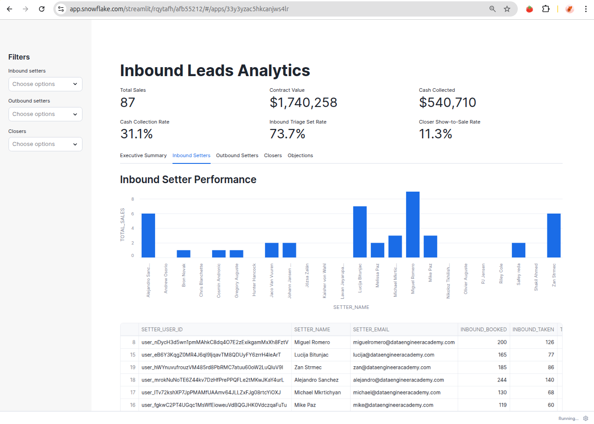
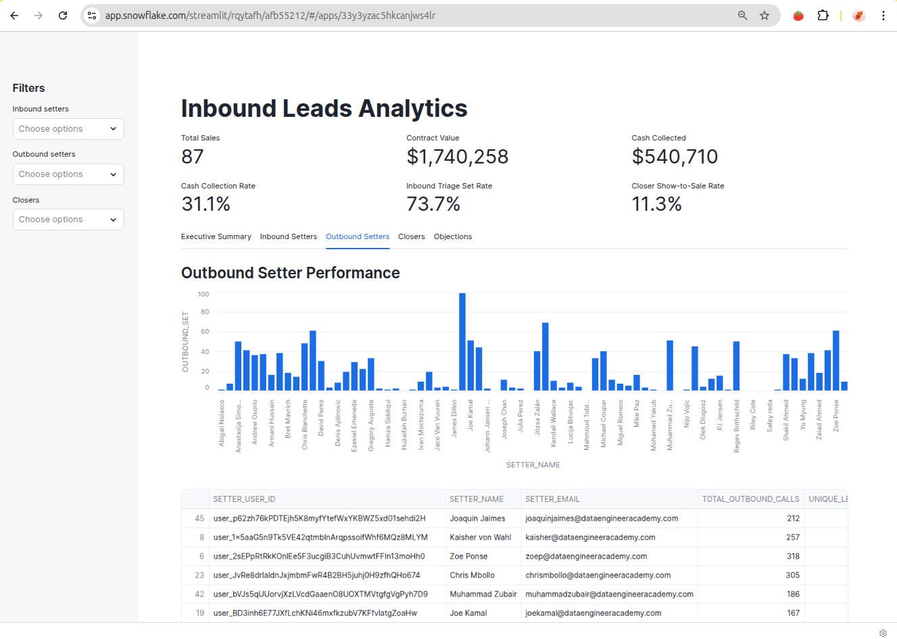
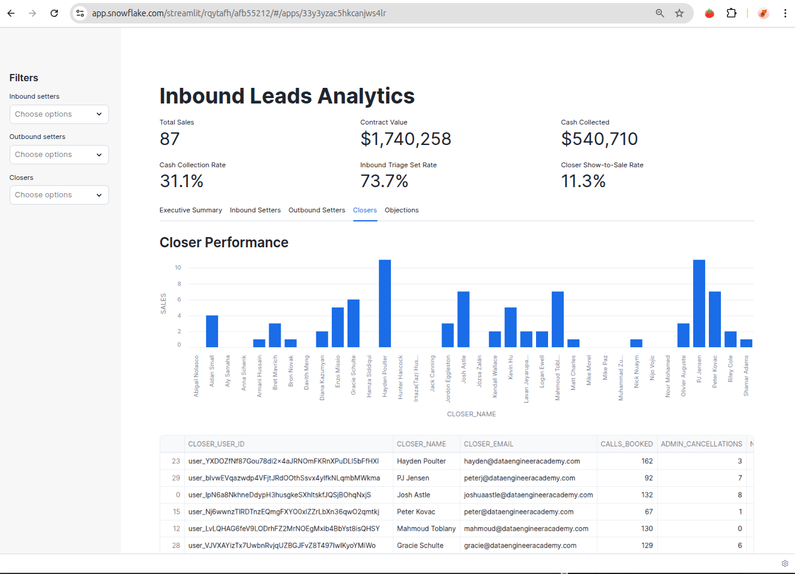
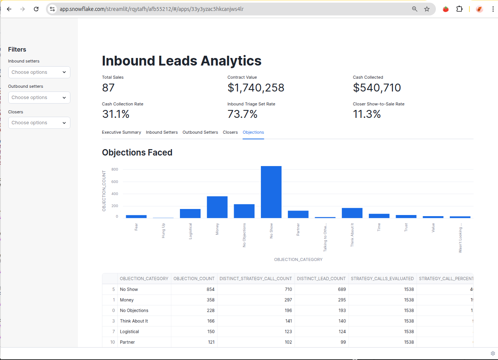

# Streamlit Dashboard

This project uses a Streamlit app in Snowflake to visualize Gold-layer reporting
models.

## App Source

The app code is stored in:

```text
streamlit/inbound_leads_dashboard.py
```

Paste this file into the Snowflake Streamlit editor when creating or updating the
app.

## Dashboard Features

The dashboard includes:

- Executive Summary tab with top-level sales, revenue, collection, and funnel
  rate KPIs.
- Inbound Setters tab with setter-level sales performance.
- Outbound Setters tab with outbound set volume and conversion performance.
- Closers tab with show, sale, and revenue performance.
- Objections tab with normalized objection counts.
- Sidebar filters for inbound setters, outbound setters, and closers.
- Formatted percentage and currency columns in the detail tables.

## Snowflake Objects

The app currently queries:

```text
INBOUND_LEADS.DBT_DEV_GOLD.RPT_INBOUND_SETTER
INBOUND_LEADS.DBT_DEV_GOLD.RPT_OUTBOUND_SETTER
INBOUND_LEADS.DBT_DEV_GOLD.RPT_CLOSER
INBOUND_LEADS.DBT_DEV_GOLD.RPT_OBJECTIONS_FACED
```

If the dbt target changes from the development schema to the final Gold schema,
update these constants in the Streamlit app:

```python
DATABASE = "INBOUND_LEADS"
SCHEMA = "DBT_DEV_GOLD"
```

For example:

```python
SCHEMA = "GOLD"
```

## Required Permissions

The app role needs access to the warehouse, database, schema, and Gold reporting
tables.

Example grants:

```sql
GRANT USAGE ON WAREHOUSE COMPUTE_WH TO ROLE BI_REPORTER;
GRANT USAGE ON DATABASE INBOUND_LEADS TO ROLE BI_REPORTER;
GRANT USAGE ON SCHEMA INBOUND_LEADS.DBT_DEV_GOLD TO ROLE BI_REPORTER;
GRANT SELECT ON ALL TABLES IN SCHEMA INBOUND_LEADS.DBT_DEV_GOLD TO ROLE BI_REPORTER;
GRANT SELECT ON FUTURE TABLES IN SCHEMA INBOUND_LEADS.DBT_DEV_GOLD TO ROLE BI_REPORTER;
```

If the reporting models are views instead of tables, also grant view access:

```sql
GRANT SELECT ON ALL VIEWS IN SCHEMA INBOUND_LEADS.DBT_DEV_GOLD TO ROLE BI_REPORTER;
GRANT SELECT ON FUTURE VIEWS IN SCHEMA INBOUND_LEADS.DBT_DEV_GOLD TO ROLE BI_REPORTER;
```

## Validation Queries

Use these queries in a Snowflake worksheet to confirm the app can see the Gold
objects:

```sql
SHOW TABLES IN SCHEMA INBOUND_LEADS.DBT_DEV_GOLD;
SHOW VIEWS IN SCHEMA INBOUND_LEADS.DBT_DEV_GOLD;

SELECT * FROM INBOUND_LEADS.DBT_DEV_GOLD.RPT_INBOUND_SETTER LIMIT 10;
SELECT * FROM INBOUND_LEADS.DBT_DEV_GOLD.RPT_OUTBOUND_SETTER LIMIT 10;
SELECT * FROM INBOUND_LEADS.DBT_DEV_GOLD.RPT_CLOSER LIMIT 10;
SELECT * FROM INBOUND_LEADS.DBT_DEV_GOLD.RPT_OBJECTIONS_FACED LIMIT 10;
```

## Dashboard Pages

<p>
  
  
</p>

<p>
  
  
</p>

<p>
  
</p>
